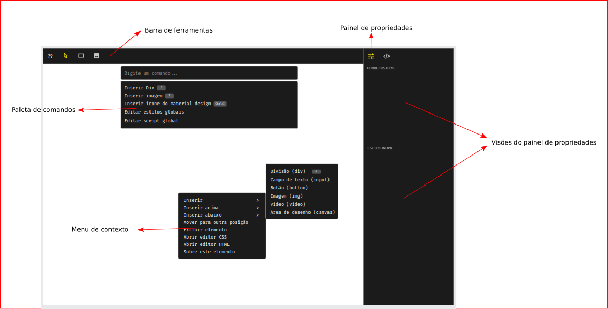

## Visão Geral de Extensões do Editor

### Visão Geral

A API de extensões do editor é composta por um conjunto de interfaces e classes que permitem que você adicione novos recursos ao editor e personalize-o para atender às suas necessidades. Você pode usar a API de extensões para adicionar novos comandos, menus, barras de ferramentas, atalhos de teclado e muito mais.

### Estrutura de Arquivos de uma Extensão

Uma extensão é composta por um conjunto de arquivos que são organizados em uma estrutura de diretórios específica. A estrutura de arquivos de uma extensão é a seguinte:

```
sua-extensao/
    ├── package.json
    ├── manifest.json
    ├── README.md
    ├── lib/
    │   ├── main.js
    │   └── ...
    └── ...
```

#### package.json

O arquivo `package.json` é um arquivo JSON que descreve as informações do projeto, como o nome e dependências da extensão. O arquivo `package.json` é usado pelo gerenciador de pacotes do Node.js para instalar as dependências da extensão mas normalmente não é utilizado pelo editor.

```json
{
    "name": "sua-extensao",
    "version": "1.0.0",
    "description": "Uma descrição da sua extensão",
    "main": "lib/main.js",
    "scripts": {
        "build": "tsc"
    },
    "dependencies": {
        "@salomaosnff/lenz.types": "^1.0.0"
    }
}
```

#### README.md

O arquivo `README.md` é o arquivo de documentação da extensão que descreve o propósito da extensão, como usá-la e como ela contribui para o editor. Este arquivo Markdown que pode conter texto, imagens, links e muito mais. O conteúdo do arquivo `README.md` é exibido na página de detalhes da extensão no editor e se parece com o seguinte:

```markdown
# Sua Extensão

Uma descrição da sua extensão.

## Comandos

- Comando 1
- Comando 2
```

## Definição de conceitos

### Extensão

Uma extensão é um pacote javascript que é carregado pelo editor para adicionar novos recursos e personalizações ao editor. Uma extensão é composta por um conjunto de arquivos que são organizados em uma estrutura de diretórios específica que inclui um arquivo `package.json`, um arquivo `manifest.json`, um arquivo `README.md` e um script de inicialização.

### Manifesto

O manifesto de uma extensão é um arquivo JSON que contém informações sobre a extensão, como o nome, a descrição, a versão, o autor, as contribuições que a extensão faz ao editor e o script de inicialização da extensão. O manifesto de uma extensão é usado pelo editor para carregar a extensão e exibir informações sobre a extensão na página de detalhes da extensão.

Adicionando um manifesto à extensão:

```json
{
    "id": "sua-extensao",
    "name": "Sua Extensão",
    "version": "1.0.0",
    "description": "Uma descrição da sua extensão",
    "publisher": "Seu Nome <seu@email.com>",
    "main": "./lib/main.js",
    "contributes": {
        "commands": [],
        "tools": [],
        "views": [],
        "keybindings": [],
        "l10n": {}
    }
}
```

Para testar sua extensão, você pode criar um link simbólico para a pasta da extensão no diretório de extensões do editor:

```bash
ln -s /caminho/para/sua-extensao $HOME/.lenz/extensions/sua-extensao
```

### Contribuição

Uma contribuição é um recurso ou personalização que uma extensão adiciona ao editor. Existem várias formas de contribuições que uma extensão pode fazer, como exemplo:

- Criar novos comandos
- Adicionar uma nova ferramenta
- Adicionar um novo painel de visualização
- Adicionar um novo atalho de teclado
- Adicionar um novo menu

Todas as contribuições de uma extensão devem ser declaradas no arquivo de manifesto no campo `contributes` para que o editor possa carregar e exibir as contribuições da extensão.

Veja na figura abaixo o nome das partes do editor para ter uma ideia de onde as contribuições podem ser feitas:



### Script de Inicialização

Um script de inicialização é um arquivo JavaScript que é executado quando a extensão é carregada pelo editor. O script de inicialização é responsável por registrar os comandos, ferramentas, visualizações, atalhos de teclado e outras contribuições que a extensão faz ao editor. O script de inicialização é especificado no arquivo de manifesto no campo `main`.

Adicionando um script de inicialização à extensão:

```javascript
// lib/main.js
const editor = require('lenz')

module.exports = {
    activate(context){
        console.log('Extensão ativada!')
    },
    deactivate(context){
        console.log('Extensão desativada!')
    }
}
```

> **ATENÇÃO:** No momento, scripts de inicialização devem ser escritos em JavaScript utilizando o sistema de módulos CommonJS.
>
> Caso prefira utilizar o sistema de módulos ES6, você pode utilizar um transpilador como o Babel ou o TypeScript para converter o código para JavaScript compatível com o CommonJS e referenciar o arquivo transpilado no campo `main` do manifesto.

#### `activate()`

A função `activate` é chamada quando a extensão é ativada pelo editor. A função `activate` recebe um objeto `context` que contém informações importantes sobre o contexto de execução da extensão, como a propriedade `subscriptions` que contém um conjunto de assinaturas que a extensão deve limpar antes de ser desativada.

#### `deactivate()`

A função `deactivate` é chamada quando a extensão é desativada pelo editor. Assim como a função `activate`, a função `deactivate` também recebe um objeto `context`.

### Comando

Um comando é um tipo de contribuição que representa uma ação que pode ser executada no editor. Ele é identificado por um ID exclusivo e um título que descreve a ação que o comando executa.

Um comando pode ser executado por meio de um atalho de teclado, um menu, ferramenta, paleta de comandos ou programaticamente por meio da API de extensões.

Adicionando um novo comando à extensão:

```json
// manifest.json
{
    // ...
    "contributes": {
        "commands": [
            {
                "id": "sua-extensao.comando1",
                "title": "Comando 1",
                "icon": "Account" // Ícone da biblioteca embutida @mdi/js
            },
            {
                "id": "sua-extensao.comando2",
                "title": "Comando 2",
                "icon": {
                    "type": "svg",
                    "path": "M12 2C6.48 2 2 6.48 2 12s4.48 10 10 10 10-4.48 10-10S17.52 2 12 2zm0 18c-4.41 0-8-3.59-8-8s3.59-8 8-8 8 3.59 8 8-3.59 8-8 8zm-1-14h2v8h-2zm0 10h2v2h-2z" // Caminho do ícone SVG
                }
            }
        ]
    }
}
```

Inicializando um comando:


```javascript
const editor = require('lenz')

module.exports = {
    activate(context){
        // Adiciona subscrição para que o comando seja removido quando a extensão for desativada
        context.subscriptions.add(
            editor.commands.registerCommand('sua-extensao.comando1', () => {
                // Executa ação do comando
                alert('Comando 1 executado!')
            })
        )
    }
}
```

Inicie o Editor e pressione `Ctrl+P` para abrir a paleta de comandos, localize o comando `Comando 1` e clique para executá-lo.

Para executar o comando programaticamente, você pode usar o método `executeCommand` da API de extensões:

```javascript
const editor = require('lenz')

lenz.commands.executeCommand('sua-extensao.comando1')
```

> **DICA:** Você pode passar argumentos para um comando utilizando o segundo parâmetro do método `executeCommand`.

### Ferramenta

Uma ferramenta é um tipo de contribuição que representa uma ação que pode ser executada no documento aberto no editor. Uma ferramenta é identificada por um ID exclusivo, um título e um ícone que descreve a ferramenta.

Uma ferramenta pode ser ativada por meio de um atalho de teclado, um menu, um comando, uma paleta de ferramentas ou programaticamente por meio da API de extensões.

Adicionando uma nova ferramenta ao editor:

```json
// manifest.json
{
    // ...
    "contributes": {
        "tools": [
            {
                "id": "sua-extensao.ferramenta1",
                "title": "Ferramenta 1",
                "icon": "Account" // Ícone da biblioteca embutida @mdi/js
            },
            {
                "id": "sua-extensao.ferramenta2",
                "title": "Ferramenta 2",
                "icon": {
                    "type": "svg",
                    "path": "M12 2C6.48 2 2 6.48 2 12s4.48 10 10 10 10-4.48 10-10S17.52 2 12 2zm0 18c-4.41 0-8-3.59-8-8s3.59-8 8-8 8 3.59 8 8-3.59 8-8 8zm-1-14h2v8h-2zm0 10h2v2h-2z" // Caminho do ícone SVG
                }
            }
        ]
    }
}
```

Inicializando uma ferramenta:

```javascript
const editor = require('lenz')

module.exports = {
    activate(context){
        // Adiciona subscrição para que a ferramenta seja removida quando a extensão for desativada
        context.subscriptions.add(
            editor.tools.registerTool('sua-extensao.ferramenta1', () => {
                // Executa ação da ferramenta
                alert('Ferramenta 1 ativada!')
            })
        )
    }
}
```

Inicie o Editor e selecione a ferramenta `Ferramenta 1` na barra de ferramentas para ativá-la.

Para ativar a ferramenta programaticamente, você pode usar o método `activateTool` da API de extensões:

```javascript
const editor = require('lenz')

lenz.tools.activateTool('sua-extensao.ferramenta1')
```

### Visão

Uma visão é um tipo de contribuição que representa uma visualização que pode ser exibida no editor. Uma visão é identificada por um ID exclusivo, um título e um ícone que descreve a visão.

Uma visão pode ser exibida por meio de um atalho de teclado, um menu, um comando ou programaticamente por meio da API de extensões.

Adicionando uma nova visão ao editor:

```json
// manifest.json
{
    // ...
    "contributes": {
        "views": [
            // Adiciona uma visão no painel de propriedades (Lado direito do editor)
            "properties": [
                {
                    "id": "sua-extensao.visao1",
                    "title": "Visão 1",
                    "icon": "Account" // Ícone da biblioteca embutida @mdi/js
                }
            ]
        ]
    }
}
```

Inicializando uma visão:

```javascript
const editor = require('lenz')

module.exports = {
    activate(context){
        const viewController = new editor.views.ViewController({
            create(element) {
                // Cria a visão
                element.innerHTML = '<h1>Conteúdo da visão 1</h1>'
            },
            show() {
                // Chamado quando a visão é exibida
            },
            hide() {
                // Chamado quando a visão é ocultada
            },
        })

        // Adiciona subscrição para que a visão seja removida quando a extensão for desativada
        context.subscriptions.add(
            editor.views.registerView('sua-extensao.visao1', viewController)
        )
    }
}
```

Inicie o Editor e selecione a visão `Visão 1` no painel de propriedades para exibi-la.

Para exibir a visão programaticamente, você pode usar o método `showView` da API de extensões:

```javascript
const editor = require('lenz')

editor.views.showView('sua-extensao.visao1')
```

### Atalho de Teclado

Um atalho de teclado é um tipo de contribuição que representa uma combinação de teclas que pode ser usada para executar um comando no editor. Um atalho de teclado é composto por uma ou mais teclas e pode ser associado a um comando específico.

Adicionando um novo atalho de teclado ao editor:

```json
// manifest.json
{
    // ...
    "contributes": {
        "keybindings": [
            {
                "key": "Ctrl+Shift+P",
                "command": "sua-extensao.comando1",
            },
            { "key": "Ctrl+Shift+Q" }
        ]
    }
}
```

Também é possível adicionar atalhos de teclado programaticamente utilizando a API de extensões, mas recomendamos sempre associar atalhos de teclado a comandos no arquivo de manifesto para que os usuários possam encontrar e personalizar os atalhos de teclado nas configurações do editor.

```javascript
const editor = require('lenz')

module.exports = {
    activate(context){
        // Adiciona subscrição para que o atalho de teclado seja removido quando a extensão for desativada
        context.subscriptions.add(
            editor.keybindings.registerKeybinding('Ctrl+Shift+Q', () => {
                // Executa ação do atalho de teclado
                alert('Atalho de teclado Ctrl+Shift+Q pressionado!')
            })
        )
    }
}
```

### Menu

Um menu é um tipo de contribuição que representa um menu de opções que pode ser exibido no editor. Um menu é composto por um conjunto de itens de menu que podem ser agrupados em submenus e associados a comandos.

Adicionando um novo menu ao editor:

```json
// manifest.json
{
    // ...
    "contributes": {
        "menus": [
            {
                "id": "seu-menu",
                "title": "Menu 1",
                "items": [
                    {
                        "id": "seu-menu/item1",
                        "title": "Item 1",
                        "command": "sua-extensao.comando1"
                    },
                    {
                        "id": "seu-menu/item2",
                        "title": "Item 2",
                        "command": "sua-extensao.comando2"
                    }
                ]
            },
            {
                // Utilize um Id já existente para adicionar mais itens ao menu
                "id": "file",
                "items": [
                    {
                        "id": "file/open-project",
                        "title": "Abrir Projeto",
                        "command": "file.openProject"
                    },
                    {
                        "id": "file/close-project",
                        "title": "Fechar Projeto",
                        "command": "file.closeProject"
                    }
                ]
            }
        ]
    }
}
```

Inicie o Editor e clique no menu `Menu 1` para exibir os itens de menu `Item 1` e `Item 2`.

Para adicionar itens de menu programaticamente, você pode usar o método `addMenuItem` da API de extensões:

```javascript
const editor = require('lenz')

module.exports = {
    activate(context){
        // Adiciona subscrição para que o item de menu seja removido quando a extensão for desativada
        context.subscriptions.add(
            editor.menus.addMenuItem('seu-menu', {
                id: 'seu-menu/item3',
                title: 'Item 3',
                command: 'sua-extensao.comando3'
            })
        )
    }
}
```

### Internacionalização

A internacionalização é um tipo de contribuição que permite que uma extensão forneça arquivos de tradução para o editor. Os arquivos de tradução são arquivos YML que contêm pares de chave-valor que mapeiam chaves de tradução para textos traduzidos em diferentes idiomas.

Adicionando arquivos de tradução à extensão:

```json
// manifest.json
{
    // ...
    "contributes": {
        "l10n": {
            // Adiciona arquivos de tradução para os idiomas en-US e pt-BR
            "en-US": "l10n/en-US.yml",
            "pt-BR": "l10n/pt-BR.yml"
        }
    }
}
```

Por convenção, os arquivos de tradução devem ser armazenados em um diretório `l10n` na raiz da extensão e devem seguir o seguinte formato:

```yaml
# l10n/en-US.yml
sua-extensao:
    hello: Hello World
```

```yaml
# l10n/pt-BR.yml
sua-extensao:
    hello: Olá Mundo
```

Para traduzir um texto em um arquivo de extensão, você pode usar o método `t` da API de extensões:

```javascript
const editor = require('lenz')

module.exports = {
    activate(context){
        alert(editor.l10n.t('sua-extensao.hello', 'en-US')) // Hello World
        alert(editor.l10n.t('sua-extensao.hello', 'pt-BR')) // Olá Mundo
    }
}
```

## Conclusão

Este documento descreveu de maneira geral a API de extensões do editor e como você pode adicionar novos recursos e personalizações ao editor por meio de extensões. Para saber mais sobre a API de extensões, consulte a referência da API de extensões no site do editor.
